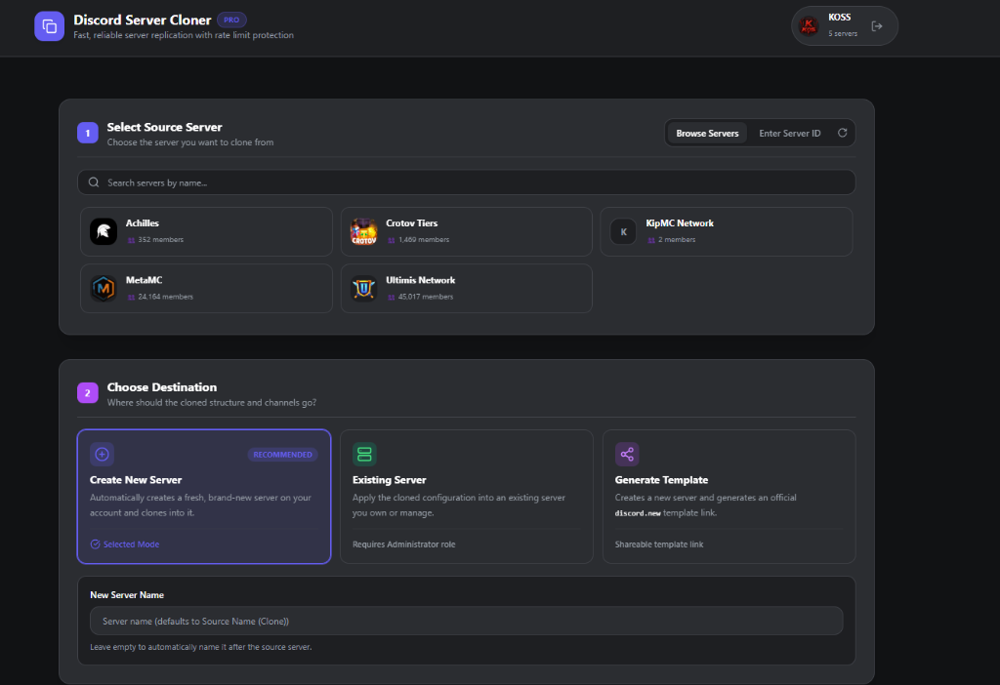
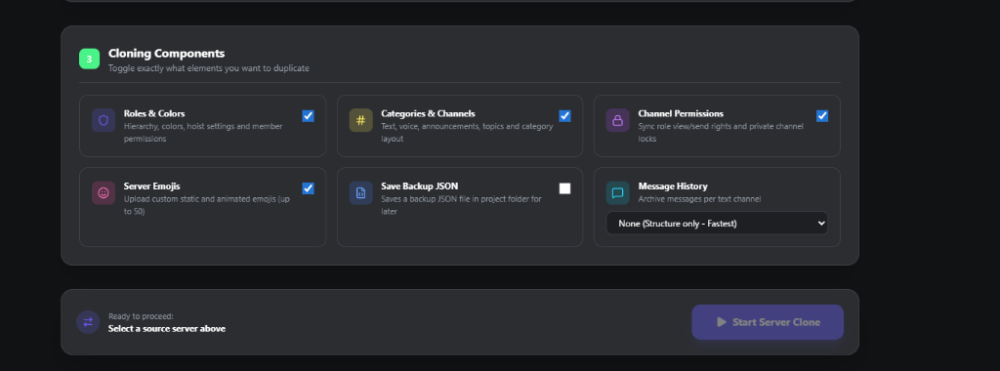
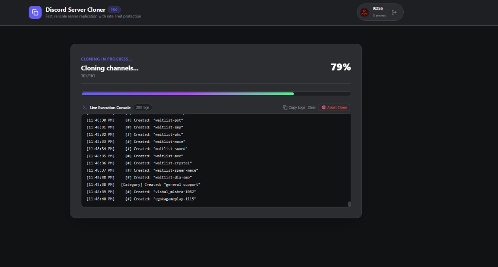

<div align="center">

# ⚡ Discord Server Cloner 3x

**Next-Gen Discord Server Replicator & Archiver with a Real-Time Web Dashboard**

[](https://github.com/bro4cvf-hash/Discord-Server-Cloner-3x)
[](https://www.typescriptlang.org/)
[](https://nodejs.org/)
[](LICENSE)

<p align="center">
  <a href="#-gui-showcase">Showcase</a> •
  <a href="#-core-features">Features</a> •
  <a href="#-quickstart">Quickstart</a> •
  <a href="#-cli-mode">CLI Mode</a>
</p>

</div>

---

## 📸 GUI Showcase

<table align="center" width="100%">
  <tr>
    <td width="50%" align="center">
      <sub><b>Step 1 & 2: Server Search & Smart Destination</b></sub><br/>
      
    </td>
    <td width="50%" align="center">
      <sub><b>Step 3: Granular Component Toggles</b></sub><br/>
      
    </td>
  </tr>
  <tr>
    <td colspan="2" align="center">
      <sub><b>Live Execution Engine: Real-Time SSE Console & Abort</b></sub><br/>
      
    </td>
  </tr>
</table>

---

## ⚡ Core Features

| Feature | Description |
| :--- | :--- |
| 🖥️ **Modern Web GUI** | Dark-mode browser dashboard at `http://localhost:4567` with auto-launch. |
| 🎯 **Smart Destinations** | Auto-create fresh servers, overwrite existing ones, or generate `discord.new` templates. |
| 🎛️ **Granular Toggles** | Selectively replicate roles, channel tree, permissions, emojis, backups & chat logs. |
| 📡 **Real-time SSE Stream** | Live percentage tracking, atomic task logs, and instant cancellation. |
| 🛡️ **Anti-Rate-Limit** | Smart throttling and queue algorithms to safeguard your account. |

---

## 🚀 Quickstart

```bash
# 1. Clone repository
git clone https://github.com/bro4cvf-hash/Discord-Server-Cloner-3x.git
cd Discord-Server-Cloner-3x

# 2. Install dependencies
npm install

# 3. Launch Web Dashboard
npm start
```

> [!TIP]
> **Windows Users:** Simply double-click `start.bat` for automatic dependency verification and one-click launch!

---

<details id="-cli-mode">
<summary><b>💻 Classic Terminal CLI Mode</b></summary>

Prefer running strictly in your terminal? Use:
```bash
npm run start:cli
```
</details>

<details>
<summary><b>⚠️ Safety Advisory & Disclaimer</b></summary>

> [!IMPORTANT]
> Automating user accounts (`selfbot`) violates Discord's Terms of Service. Always test on secondary/burner accounts. Use responsibly.
</details>

---

<div align="center">
<sub>Enhanced fork of <a href="https://github.com/joaokristani/Discord-Server-Cloner-2x">joaokristani/Discord-Server-Cloner-2x</a> • Built by <a href="https://github.com/bro4cvf-hash">bro4cvf-hash</a></sub>
</div>
